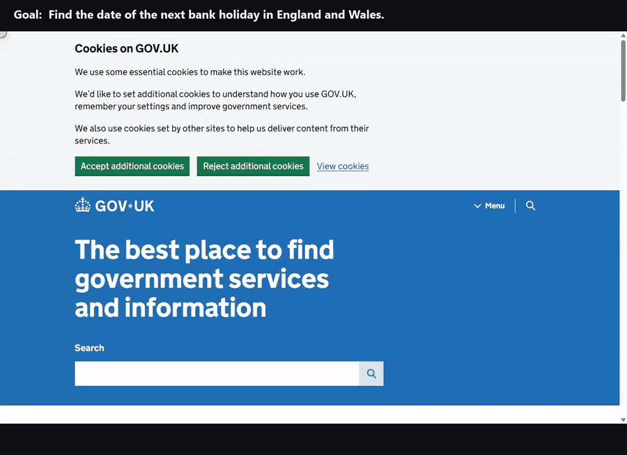

# Clearcote Jet

**Tell it what you want done on a website. Jet reads the page, picks the next step in about a quarter of a second,
does it with a real mouse and keyboard in [Clearcote](https://clearcotelabs.com), and hands you the answer.**



*Three live runs, recorded in real time; the captions are added afterwards from each run's log. Every step shows what
Jet did, how sure it was, and how long it took to decide. [Watch the MP4](docs/demo.mp4).*

## Why use it

- **Fast.** Each decision took 235 to 473 ms in our runs. Most of a run is the browser, not the thinking.
- **Cheap.** A finished task averaged 17,973 input tokens: about **$0.0008, or $0.76 per 1,000 tasks**.
- **Learned once, then free.** A task that worked is saved as a skill: the same goal from the same page then runs
  again with **no model calls** (24 of 24 replays in our runs), and where the page has changed, the agent takes over for
  that part and saves it again.
- **You can see why.** Every step comes with the probability behind it and the options it passed over, so a shaky
  step stands out.
- **It uses the page like a person.** Curved mouse paths, key-by-key typing, dropdowns picked from the open list, and
  a cookie banner is just another thing to click (it declines when it can).
- **One loop for every site.** There is no per-site code: the same loop looks at the page again after every step.

## Try it in two minutes

```bash
git clone https://github.com/clearcotelabs/clearcote-jet && cd clearcote-jet
pip install -e .
cp .env.example .env          # add TYPESAFE_API_KEY
python examples/run_task.py   # watch it find the next UK bank holiday, cursor drawn
```

Just the library: `pip install git+https://github.com/clearcotelabs/clearcote-jet`.

## What it did in our runs

Live, in a visible Clearcote window, 29 September 2026:

| Task | Result | Steps | Decisions | Time | Input tokens | Cost |
|---|---|---|---|---|---|---|
| GOV.UK: find the next bank holiday in England and Wales | done: 25 December | 4 | 5 | 14.8 s | 13,654 | $0.0006 |
| Python docs: search `asyncio.gather` and open its entry | done | 3 | 4 | 10.9 s | 29,048 | $0.0012 |
| Python docs: switch the page to version 3.12 | done | 1 | 2 | 4.4 s | 19,349 | $0.0008 |
| Hacker News: open the top story's comments | done | 1 | 2 | 2.7 s | 29,877 | $0.0013 |
| RFC 9110: jump to the section on 404 Not Found | stopped at the 60-step cap | 60 | 60 | 92.3 s | 368,958 | $0.0155 |

The last row is a failure we kept on purpose: on a very long document it scrolled instead of using the table of
contents. Jet now jumps to a section the goal names: on the same page it goes straight to "404 Not Found" in one step
(13,793 input tokens, $0.0006, in 3 of 3 runs on 2 October 2026). For a goal that names no place it still scrolls, and
stops after 12 scrolls in a row.

A GOV.UK run, step by step:

```text
1. click  "Reject additional cookies"   p=0.85   decided in 361 ms
2. type   "next bank holiday" into "Search"   p=1.00
3. click  "Search GOV.UK"   p=0.93
4. click  "UK bank holidays"   p=0.99
done · 4 actions · 5 decisions · 14.8 s · 13,654 input tokens ≈ $0.0006
```

## What it costs

- **Decision model:** $0.042 per million input tokens; output tokens are free. That is the published rate on
  29 September 2026; set `CLEARCOTE_JET_USD_PER_MTOK` if yours differs.
- **Measured** (seven everyday tasks, three runs each, 2 October 2026): 10,372 to 30,031 input tokens per finished
  task, so $0.0004 to $0.0013, about a quarter fewer than before that day's request trimming. **A replayed skill: 0.**
- **Not included:** your [Clearcote](https://clearcotelabs.com) licence, and an optional text model, which bills with its
  own provider.
- **Your own runs:** every result carries `usage` (tokens, requests, `estimated_usd`), and
  `python examples/estimate_cost.py` totals everything in `runs/` and projects the cost per 1,000 tasks.

## Learned once, replayed for free

The first time a goal finishes from a start page, Jet saves how it did it as a **skill**: each step with how to find its
control again (role, label, and its place among controls labelled alike; numbers in a label may change, so "87
comments" is found again as "213 comments"), how the run ended, and how the page's list of results is read. The next
time the same goal is run from the same page, Jet replays the skill with **no model calls**. A cookie banner that
doesn't show again is skipped. If the page has changed (a button renamed, a step that is gone, an ending that doesn't
match), the agent takes over from that point, decides only what changed, and saves the skill again.

If the results came from a JSON request, the skill keeps that request too, and a replay reads the rows with it from
inside the page, without clicking at all.

| 2 October 2026, 8 tasks × 3 runs | Worked out step by step | Replayed |
|---|---|---|
| Passed | 21 of 24 | 24 of 24 |
| Model requests per task | 5.6 | 0 |
| Input tokens per task | 17,450 | 0 |

Replays are not much faster: most of a run is the browser and its human-paced input, not the model.

Skills are JSON files in `~/.clearcote-jet/skills` (`CLEARCOTE_JET_SKILLS`). On the command line, `--no-skill` works a
task out step by step and saves nothing; over MCP, `browse(..., reuse=False)` does the same, and `list_skills` /
`forget_skill` manage them. A skill is for one goal from one page: another search term is another skill.

## Results without a model

When a run finishes on a page with a list of results (search hits, products, listings), `items` holds its rows, read
from the page's layout with no model: a title, a link, a price (the sale price, not a struck-out one) and an image,
each found with a selector that works for most rows. The navigation, header and footer are left out.

## Use it

### Python

```python
import asyncio
from clearcote_jet import Session, run

async def main():
    session = await Session.launch(headless=False)
    page = await session.new_tab("https://www.gov.uk/")
    result = await run(session, "Find the date of the next bank holiday in England and Wales.", page=page)
    print(result["status"], result["url"], result["usage"]["estimated_usd"])
    for step in result["trace"]:
        print(step["step"], step["kind"], step["action"], step["probability"], step["alternatives"])
    print(result["markdown"])
    await session.close()

asyncio.run(main())
```

### Command line

```bash
clearcote-jet run --url https://docs.python.org/3/ --goal "Find the entry for asyncio.gather" --show-cursor

# keep one browser open and send it tasks
clearcote-jet browser --port 9222
clearcote-jet run --cdp http://127.0.0.1:9222 --url https://news.ycombinator.com/ --goal "Open the top story's comments"
```

Flags: `--show-cursor` (draw the mouse), `--keep-open`, `--headless`, `--no-humanize`, `--profile DIR`,
`--confirm` (stop before a click that can't be taken back), `--no-skill` (don't learn or replay; see below).

### As a tool for your AI assistant (MCP)

```json
{
  "mcpServers": {
    "clearcote-jet": {
      "command": "clearcote-jet-mcp",
      "env": { "TYPESAFE_API_KEY": "...", "CLEARCOTE_LICENSE_KEY": "..." }
    }
  }
}
```

Your assistant gets these tools:

| Tool | What it does |
|---|---|
| `browse(goal, url?, tab_id?, confirm?, reuse?)` | runs a whole task and returns every step, the rows of any list of results, and the page content. A task started from a `url` is learned once and replayed with no model after (`reuse=False` turns that off); `confirm=True` stops before any click that can't be taken back and says which `act` call goes ahead |
| `snapshot(tab_id?, url?, screenshot?)` | shows a tab exactly as Jet sees it: the numbered element table (`[3] button "Send request"`) and the visible text, optionally with an image |
| `act(tab_id, op?, target?, instruction?, text?, screenshot?)` | one step by hand: `op` + `target` from the latest snapshot (`CLICK "3"`, `TYPE_TEXT "1"` with `text`, `SELECT "4:2"`, `SCROLL_DOWN`, `FIND_TEXT` with `text`), with no model call; or `instruction` in plain words, one decision |
| `list_skills()`, `forget_skill(goal, url)` | the tasks it has learned; forget one so it is worked out again |
| `close_tab(tab_id)` | closes a tab |

When `browse` stops (`blocked`, `needs_input`), the assistant can look with `snapshot`, do a step with `act`, and hand
back to `browse(goal, tab_id=...)`. `act` returns the new snapshot, so steps chain; if what a step depends on changed
since the snapshot, it does nothing and answers `stale`. Tabs stay open between calls, several tasks can run at once in
their own tabs (a second call on a busy tab answers `busy`), and the browser shuts itself down after a few idle minutes.
It also closes when the server stops (its input closed, Ctrl+C, Ctrl+Break, SIGTERM or SIGHUP), so no browser or
temporary files are left behind. Screenshots are taken without touching the page's DOM; one over 200 KB is saved to a file and its path returned
instead of the image.

Guard rails: every tool carries MCP annotations (`snapshot` and `list_skills` only read; `browse` and `act` can change
things on websites), so a client can decide which calls need your approval. Only `http`/`https` urls are accepted,
read the way the browser reads them (`file:`, `view-source:`, `chrome:` and every other scheme are refused, always),
and this machine, the local network and cloud metadata addresses are refused: for the url a tool gets and for every
request the browser then makes (redirects, images, frames, script requests, popups), unless
`CLEARCOTE_JET_ALLOW_PRIVATE_EGRESS=1` (needed for local servers). Checking every request turns the browser's HTTP
cache off. Not covered: WebSocket connections a page script opens, a host name whose address changes between the
check and the browser's own lookup (DNS rebinding), a redirect in the very first load of a popup, and redirects of
requests made inside workers or cross-site frames. Every call has a time limit (typing gets extra time per character;
the tab stays open when it runs out), and page content comes back between `<untrusted_page_content>` tags that nothing
on the page can close or imitate: the text and title in one block, and every element label (and any status detail
that quotes one) in tags of its own.

### Settings

Put them in `.env` (see `.env.example`) or the environment:

| Variable | Default | What it does |
|---|---|---|
| `TYPESAFE_API_KEY` | required | key for the decision model (from console.typesafe.ai) |
| `CLEARCOTE_LICENSE_KEY` | `~/.clearcote/license.key` | your Clearcote licence; without one the open build runs |
| `TEXT_MODEL_BASE_URL`, `TEXT_MODEL_API_KEY`, `TEXT_MODEL` | unset | optional OpenAI-compatible model that writes typed values; without it Jet types words taken from your goal |
| `CLEARCOTE_JET_PROFILE` | `~/.clearcote-jet/profile` | browser profile; cookies and consent choices persist |
| `CLEARCOTE_JET_PROXY` | unset | route through a proxy; timezone, language and location follow its exit IP |
| `CLEARCOTE_JET_HEADLESS` | off | `1` runs without a window |
| `CLEARCOTE_JET_HUMANIZE` | on | `0` switches to instant clicks and typing |
| `CLEARCOTE_JET_CDP` | unset | attach to a browser that is already running |
| `CLEARCOTE_JET_IDLE_MINUTES` | `5` | MCP server: close the browser after this long without calls |
| `CLEARCOTE_JET_TASK_TIMEOUT` | `900` | MCP server: seconds a `browse` call may run before it is stopped |
| `CLEARCOTE_JET_TOOL_TIMEOUT` | `120` | MCP server: the same for every other call (`act` gets 0.5 s more for each character it types) |
| `CLEARCOTE_JET_ALLOW_PRIVATE_EGRESS` | off | MCP server: `1` allows urls on this machine or the local network (still `http`/`https` only) |
| `CLEARCOTE_JET_INLINE_IMAGE_MAX` | `200000` | MCP server: the largest screenshot (bytes) sent as an image; a bigger one is saved to a file |
| `CLEARCOTE_JET_SCREENSHOTS` | `~/.clearcote-jet/screenshots` | MCP server: where those are saved; the newest 20 are kept |
| `CLEARCOTE_JET_SKILLS` | `~/.clearcote-jet/skills` | where learned tasks are kept, one JSON file each |
| `CLEARCOTE_JET_USD_PER_MTOK` | `0.042` | rate used for the cost estimate |

## Reading a result

| Field | Meaning |
|---|---|
| `status` | `done`, `blocked` (nothing on the page, its closed menus and scroll boxes included, can move it forward, or it scrolled 12 times in a row), `needs_input` (the goal lacks a value a field needs), `needs_confirmation` (with `confirm`: the next click can't be taken back), `budget` (hit the step cap) or `error` |
| `trace` | every step: what was done, the text typed, its probability, the runner-up options and how long the decision took (replayed steps are marked `replayed`) |
| `stale` | steps that were decided again because the page changed before Jet could act |
| `usage` | decision-model tokens and requests, `estimated_usd`, and any text-model tokens |
| `markdown` | the parts of the final page that answer the goal; for a run that did not finish, what was on screen |
| `items` | the rows of the final page's list of results (title, link, price, image), read without a model; empty if there is none |
| `skill` | with skills: `learned`, `replayed`, `shortcut` (the rows came straight from the request behind the list) or `repaired` |
| `pending` | with `confirm`: the click it stopped before |

## How it works

1. **Look.** Jet lists the controls a person could use right now: visible, enabled, not hidden behind a pop-up,
   including those inside embedded frames (iframes), same-site or cross-site. Password fields can be filled
   but are never read: Jet only sees whether one is empty, never what it holds. When it gets stuck on a page (the
   model finds no way forward there, or it has scrolled three times in a row), it also lists the links inside the
   page's closed menus: navigation dropdowns, menu panels and collapsed sections, each named by its menu
   (`Docs › Recommended settings`). To click one, it opens the menu the way a person does, pointing at it (or
   clicking it, if pointing opens nothing), moves down inside the menu and clicks the link. It lists, too, what is
   scrolled out of view inside a box that scrolls on its own (a phone menu's panel, a dialog, a side list, a row of
   cards), which scrolling the page does not reach; it wheels over that box until the control is in view.
2. **Decide.** One request to the decision model picks the kind of step and the control together, with a probability for
   every option. The model only chooses from that list; it never writes code or coordinates.
3. **Act.** Jet checks that the page has not changed, then moves the mouse along a curved path, clicks, and types key by
   key. Page reads run in a separate, isolated context, so the page's own scripts don't see them. On a long page it can
   also jump to words from your goal, through the page's own anchor when there is one.
4. **Answer.** When the goal is met, the page is turned into markdown, and the sections around where the run ended are
   scored against the goal. A list of results on the page is read row by row, from its layout, with no model.
5. **Remember.** A finished task is saved as a skill (see below), so the next run of it needs no model.

## Examples

| File | What it shows |
|---|---|
| [`examples/quickstart.py`](examples/quickstart.py) | the smallest program: one goal, the steps, the answer |
| [`examples/run_task.py`](examples/run_task.py) | any goal in a visible window with the cursor drawn; the run is saved to `runs/` |
| [`examples/gallery.py`](examples/gallery.py) | four tasks on four kinds of site, with a summary |
| [`examples/estimate_cost.py`](examples/estimate_cost.py) | tokens and dollars for your saved runs, projected per 1,000 tasks |
| [`examples/record_demo.py`](examples/record_demo.py) | records live runs and turns them into a captioned MP4 and GIF (needs ffmpeg) |

## Known limits

- On a long page it jumps to a section the goal names; when the goal names none, it may scroll rather than use a table
  of contents, and stops after 12 scrolls in a row with `blocked`.
- Links that open a new tab are not followed, and closed shadow roots, canvas apps, file uploads and CAPTCHAs are not
  handled. Controls inside iframes are; scrolling inside an iframe is not.
- Links inside closed menus, and controls scrolled away inside a scroll box, are offered only once a run is stuck on
  a page, and one level deep: a submenu inside a menu is not opened, nor a box scrolled away inside another box.
- `done` is the model's judgement. Check what matters.
- Jet only types words that appear in your goal (unless you configure a text model), so write the values into it.

Built for privacy, testing, research and lawful automation.

## Development

```bash
pip install -e . pytest ruff
python -m playwright install chromium      # optional: the tests that need a browser use it, else they skip
ruff check . && pytest tests -q            # offline: no network, no model calls
python tests/e2e/check_browser_layer.py    # visible browser, scripted steps, a local test page
python tests/e2e/check_full_loop.py        # the whole loop with a stand-in for the model
python tests/e2e/check_frames.py           # controls inside same-site and cross-site iframes
python tests/e2e/check_mcp_tools.py        # snapshot and act on a local form (one live step if a key is set)
python tests/e2e/check_mcp_stdio.py        # the MCP server over stdio, as an assistant runs it
python tests/e2e/check_mcp_hardening.py    # annotations, refused local urls, time limits, big screenshots to a file
python tests/e2e/check_skills.py           # learn, replay, repair, lists, the request shortcut, confirm and find
```

## License

MIT, see [LICENSE](LICENSE).
